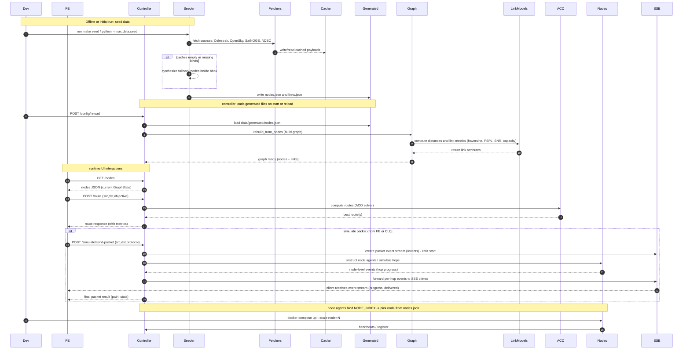

# aco-sagsin-sim

Ant Colony Optimization (ACO) path selection simulator for SAGSIN (Space–Air–Ground–Sea Integrated Network).

Run locally with Docker Compose and interact via a REST API.

## Quick start

Prerequisites: Docker Desktop (daemon running), Docker Compose, make.

1) Copy env and config

```
cp .env.example .env
```

2) Seed data (fetch with cache, clustering, bbox as configured). If offline and no cache, a small synthetic graph is generated so the API still works:

```
make seed
```

3) Launch controller and node agents:

```
make up
```

4) Query route (example src=1, dst=25):

```
curl -s -X POST localhost:8080/route \
  -H "Content-Type: application/json" \
  -d '{"src":1,"dst":25}' | jq .
```

5) Inspect nodes/links:

```
curl -s localhost:8080/nodes | jq . | head
curl -s localhost:8080/links | jq . | head
```

6) Toggle a link or advance an epoch:

```
curl -s -X POST localhost:8080/simulate/toggle-link -H 'Content-Type: application/json' -d '{"u":1,"v":2,"enabled":false}'
curl -s -X POST localhost:8080/simulate/set-epoch
```

7) Reload config.yaml at runtime:
```
curl -s -X POST localhost:8080/config/reload
```

## Start and Stop the app

Start (foreground, uses Makefile):

```bash
# default scales node agents from NODES (defaults to 50 in Makefile)
make up

# scale to a specific number of node agents
NODES=600 make up
```

Start (detached, direct Docker Compose alternative):

start controller
```bash
# build and run detached, scaling node service
# docker compose up -d --build --scale node=10
# docker compose up -d --build controller
docker compose up -d  controller

```

start node agent
```bash
# recommended: scale in bulk with lower parallelism to avoid daemon flakiness
FORCE_DERIVED_INDEX=true COMPOSE_PARALLEL_LIMIT=5 docker compose up -d --scale node=200

# if you see "FORCE_DERIVED_INDEX ... could not derive" on some replicas,
# either rerun (reverse DNS may take a moment) or temporarily relax strict mode:
# FORCE_DERIVED_INDEX=false COMPOSE_PARALLEL_LIMIT=5 docker compose up -d --no-recreate --scale node=200

# note: strict derivation is most reliable if the Docker socket is mounted read-only
# (already configured in docker-compose.yml for the node service):
#   - /var/run/docker.sock:/var/run/docker.sock:ro
```

Stop the stack (keep volumes/cache):

```bash
docker compose down
```

Stop the stack and remove volumes (reset generated/cache data):

```bash
# Makefile convenience
make down

# or with docker compose directly
docker compose down -v
```

## Configuration

- `.env` controls environment variables, e.g. offline mode and epoch duration.
- `config.yaml` controls data sources, clustering, link model params, ACO params, ranges, elevation, etc.

Key flags:
- enable_sea/ground/sat/air: turn sources on/off
- enable_clustering, cluster_radius_km
- bbox filter
- epoch_sec controls dynamic updates
- offline uses cache when network unavailable

Selection (optional):
- `selection.continent`: one of asia, europe, africa, north_america, south_america, america, oceania.
- `selection.node_limit`: max nodes to keep (0 = unlimited).
- `selection.type_mix`: percentage mix per kind, e.g. `{sat: 0.3, air: 0.5, ground: 0.2, sea: 0.0}`.

Notes:
- Selection is applied after bbox and clustering.
- When `type_mix` is provided with `node_limit`, quotas are computed from the mix and filled greedily; any remainder is backfilled from remaining nodes.

## Development

Formatting/linting: ruff, black, mypy.

Tests:

```
pytest -q
```

## Services

- controller: FastAPI on :8080
  - GET /nodes
  - GET /links
  - POST /route {src,dst,objective?}
  - POST /simulate/toggle-link
  - POST /simulate/set-epoch
  - POST /simulate/send-packet {src,dst,protocol}
  - GET /events (SSE stream for packet-progress)
  - POST /config/reload

- node agent: one per container, binds NODE_INDEX to a node from nodes.json and heartbeats.

## Notes

- Data is cached under `data/cache` with TTL.
- If offline, seed uses cache and falls back to a tiny synthetic toy graph if cache is empty, so /route still works.
- The ACO objective normalizes latency, inverse-capacity, energy, inverse-reliability to [0,1] with weights.

## MongoDB Integration (Optional)

You can persist fetched source payloads and the generated `nodes` dataset in MongoDB for sharing across runs/containers.

Enable it via environment variables or `config.yaml` top-level keys:

```yaml
enable_db: true
mongo_uri: "mongodb://localhost:27017"   # or your remote URI
mongo_db: "aco"
mongo_cache_collection: "cache"
mongo_nodes_collection: "nodes"
mongo_connect_timeout_sec: 5.0
```

Or set environment variables (override YAML):

```bash
export ENABLE_DB=true
export MONGO_URI="mongodb://localhost:27017"
export MONGO_DB="aco"
export MONGO_CACHE_COLLECTION="cache"
export MONGO_NODES_COLLECTION="nodes"
export MONGO_CONNECT_TIMEOUT_SEC=5
```

Behavior:

- Fetchers first try MongoDB (cache collection) for a fresh (TTL-valid) payload; if missing or expired they do HTTP fetch and then write both file cache and MongoDB.
- Seeder always writes `data/generated/nodes.json` and, when enabled, also stores the full list of nodes in `mongo_nodes_collection` under document `_id = "nodes"`.
- Controller startup & `/config/reload` prefer MongoDB nodes (if available) and fall back to file or toy nodes.
- If MongoDB is unreachable or `enable_db=false`, everything transparently falls back to local JSON files.

Install driver (already in `pyproject.toml`):
```bash
poetry install   # or pip install pymongo
```

Quick test with local Mongo:
```bash
docker run --rm -d -p 27017:27017 --name aco-mongo mongo:6
export ENABLE_DB=true MONGO_URI="mongodb://localhost:27017"
make seed
make up
curl -s localhost:8080/nodes | jq '. | length'
```

## Packet simulation

- Start a packet and observe events:

- Observe event:
```bash
curl -s -X POST http://localhost:8080/simulate/send-packet \
  -H 'content-type: application/json' \
  -d '{"src":0,"dst":1,"protocol":"UDP"}' | jq .
```

- Start send a packet
```bash
# curl -s -N http://localhost:8080/events &
# curl -s -X POST http://localhost:8080/simulate/send-packet \
#   -H 'content-type: application/json' \
#   -d '{"src":1,"dst":25,"protocol":"UDP"}' | jq .

curl -sS -X POST http://localhost:8080/simulate/send-packet \
  -H 'Content-Type: application/json' \
  -d '{"src":4,"dst":117,"protocol":"TCP","message":"hello from host"}' | jq

```

- From inside the image (or via docker exec), you can use a small CLI:

```bash
docker compose run --rm controller python -m src.tools.send_packet_cli --src 1 --dst 25 --protocol UDP
```


 ## Sequence Diagram (Ctrl + Shift +V (need Markdown Preview Mermaid Support exrention on VSCode installed))
